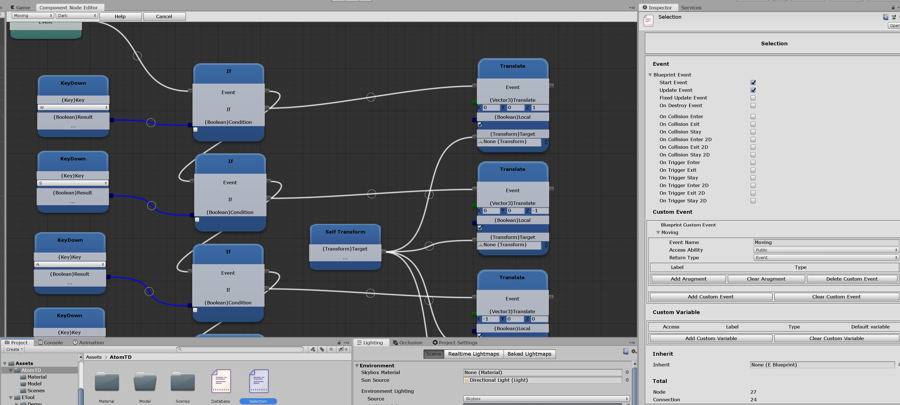

# Rebirth

> The unity plugin for interactive design

## Why use Rebirth

- Great tool to make game logic  
  
the user don't have to understand programming

- Easy to use  
  
if user have problem with node, user can always right click check its description

## Installation
- Put ETool folder into (project folder)/assets/
## feature

- Basic number calculation  
  
float int long double

- Basic logic  
  
and, or, not, number compare, math etc.. 

- Transform (local global) (position rotate scale eular_angle) manipulate  
  
 transform method support

- Public Protected Private event support  
  
 user can create your own function

- Public Protected Private variable support  
  
 user can create your own variable

- Array support (In Development)  
  
 data support array type

- Blueprint inherit (In Development)  
  
 blueprint multiple inherit support

- GameData scriptable_object (In Development)  
  
 user can create a gamedata asset in scenes, make your own database. gamedata also support import and export

- Component type support (In Development)  
  
 there are little type this plugin support right now

